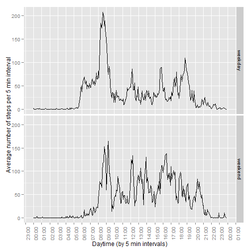

## Checking pre-requisites
Since this study relies upon certain R packages, the missing packages will be 
automatically installed from the default repository (this is the [reference](http://stackoverflow.com/questions/4090169/elegant-way-to-check-for-missing-packages-and-install-them) to the explanation of the trick).


```r
list.of.packages <- list("data.table", 
                         "lubridate","ggplot2","grid","gridExtra","scales",
                         "xtable","dplyr","tidyr")
new.packages <- list.of.packages[!(list.of.packages %in% installed.packages()[,"Package"])]
if(length(new.packages)) suppressPackageStartupMessages(install.packages(new.packages))
librarystr <- function(libname) { invisible(suppressPackageStartupMessages(eval(parse(text=sprintf("library(%s)",libname))))) }
invisible(lapply(list.of.packages,librarystr))
```

For the safety purposes, e.g. missing the source datasource activity.zip or in case the script runs in a wrong 
directory, there is a code which can download the zip file from the original site.


```r
# The local  zip file
zipfile<-"activity.zip"
# Extract the source datafile inside the downloaded zip file
datafile<-"activity.csv"

# Download only if the zip file is missing (formally not required)
if ( !file.exists(zipfile) ) {
    url<-"https://d396qusza40orc.cloudfront.net/repdata%2Fdata%2Factivity.zip"
    download.file(url,zipfile, mode="wb")
    }
```


## Loading and preprocessing the data


The read.csv keeps default behavior(*stringsAsFactors=TRUE*) since this way it 
is easier to summarize daily activities. 


```r
# Actually reading the data and converting to data.table
activitytbl<-tbl_df(read.csv(
    unz(filename=datafile,description = "./activity.zip"),
    stringsAsFactors=TRUE))
activitytbl
```

```
## Source: local data frame [17,568 x 3]
## 
##    steps       date interval
## 1     NA 2012-10-01        0
## 2     NA 2012-10-01        5
## 3     NA 2012-10-01       10
## 4     NA 2012-10-01       15
## 5     NA 2012-10-01       20
## 6     NA 2012-10-01       25
## 7     NA 2012-10-01       30
## 8     NA 2012-10-01       35
## 9     NA 2012-10-01       40
## 10    NA 2012-10-01       45
## ..   ...        ...      ...
```

Preprocessing adds extra columns related to the date and time for future use.
First we define the transformation for the timestamps.
*Note: the dates and daytime will be handled separately in the code below.

```r
zeroday<-ymd("1970-01-01")
toTime <- function(interval) {
    as.POSIXct(zeroday+hours(interval%/%100)+minutes(interval%%100))
    }


# Convert the dates, but keep the original dates as factors
activitytbl<-activitytbl %>% mutate(datevar=ymd(activitytbl$date), timevar=toTime(interval))

dailyActivity<-activitytbl   %>% 
    dplyr::filter(!is.na(steps))    %>% 
    group_by(date)  


dailyStepsSummary <- dailyActivity  %>%  summarise(nsteps=sum(steps))
```
## What is mean total number of steps taken per day?

Plotting with 2 bin sizes (smaller bins help to see the days with zero or top activity, larger bins show better the smoothered distribution )

```r
fineHist<-qplot(nsteps,data=dailyStepsSummary, geom="histogram", 
                binwidth=5000, main="Daily steps (Bin width = 5000)", xlab="Steps count", ylab="Day count")
roughHist<-qplot(nsteps,data=dailyStepsSummary, geom="histogram", 
                 binwidth=1000,main="Daily steps (Bin width = 1000)", xlab="Steps count", ylab="Day count")
grid.arrange(fineHist, roughHist, ncol=2, nrow=1)
```

 


```r
stepsummary <- dailyStepsSummary %>% summarize(Mean=mean(nsteps),Median=median(nsteps)) %>% as.data.frame.array
rownames(stepsummary)<-c("Number of steps per day")
print(xtable(stepsummary), type="html")
```

<!-- html table generated in R 3.1.2 by xtable 1.7-4 package -->
<!-- Mon Dec 15 01:55:07 2014 -->
<table border=1>
<tr> <th>  </th> <th> Mean </th> <th> Median </th>  </tr>
  <tr> <td align="right"> Number of steps per day </td> <td align="right"> 10766.19 </td> <td align="right"> 10765.00 </td> </tr>
   </table>


## What is the average daily activity pattern?


```r
activityTblClean <- activitytbl %>% 
    dplyr::filter(!is.na(steps)) # %>%  # Remove NAs

dailyActivityPattern<-activityTblClean %>% 
    group_by(interval) %>% 
    summarise(nsteps_per_interval=mean(steps, na.rm = TRUE))

handleStyleAndTime <- function(plt) {
    plt +
    #theme_bw() +
    theme(
        plot.background = element_blank()
        #,panel.grid.major = element_blank()
        #,panel.grid.minor = element_blank(
        ,panel.border = element_blank()
        ,axis.text.x=element_text(angle=90)
        )+
    scale_x_datetime(breaks=date_breaks("1 hour"), 
                     minor_breaks=date_breaks("1 hour"),
                     labels =date_format("%H:%M") )
}

plt<-qplot(x=toTime(interval), y=nsteps_per_interval, 
      data=dailyActivityPattern,geom="line",
      ylab="Number of steps per 5 min interval", 
      xlab="Interval") 
handleStyleAndTime(plt)    
```

 

```r
peakinterval <- (dailyActivityPattern %>% arrange(desc(nsteps_per_interval)))$interval[1]
```

**Daily peak interval (result):**


```r
cat(sprintf("Peak activity (numer of steps) 5 min interval time: % 2d:%02d",
              peakinterval%/%100,peakinterval%%100))
```

Peak activity (numer of steps) 5 min interval time:  8:35


#The analysis of the missing data.

```r
numberOfMissingValues<-sum(!complete.cases(activitytbl))
cat(sprintf("Number of missing values in the dataset: %d", numberOfMissingValues))
```

Number of missing values in the dataset: 2304

```r
#Summary of missing days: 

cat("Summary of all dates with missing data:")
```

Summary of all dates with missing data:

```r
daysWithMissingData <- activitytbl %>% 
    dplyr::filter(is.na(steps)) %>% 
    group_by(date)       %>% 
    summarise(NAsperday=n()) %>%  
    mutate(weekday=weekdays(ymd(date)))

print(xtable(as.data.frame(daysWithMissingData)),type="html")
```

<!-- html table generated in R 3.1.2 by xtable 1.7-4 package -->
<!-- Mon Dec 15 01:55:07 2014 -->
<table border=1>
<tr> <th>  </th> <th> date </th> <th> NAsperday </th> <th> weekday </th>  </tr>
  <tr> <td align="right"> 1 </td> <td> 2012-10-01 </td> <td align="right"> 288 </td> <td> Monday </td> </tr>
  <tr> <td align="right"> 2 </td> <td> 2012-10-08 </td> <td align="right"> 288 </td> <td> Monday </td> </tr>
  <tr> <td align="right"> 3 </td> <td> 2012-11-01 </td> <td align="right"> 288 </td> <td> Thursday </td> </tr>
  <tr> <td align="right"> 4 </td> <td> 2012-11-04 </td> <td align="right"> 288 </td> <td> Sunday </td> </tr>
  <tr> <td align="right"> 5 </td> <td> 2012-11-09 </td> <td align="right"> 288 </td> <td> Friday </td> </tr>
  <tr> <td align="right"> 6 </td> <td> 2012-11-10 </td> <td align="right"> 288 </td> <td> Saturday </td> </tr>
  <tr> <td align="right"> 7 </td> <td> 2012-11-14 </td> <td align="right"> 288 </td> <td> Wednesday </td> </tr>
  <tr> <td align="right"> 8 </td> <td> 2012-11-30 </td> <td align="right"> 288 </td> <td> Friday </td> </tr>
   </table>

```r
cat(sprintf("Missing days (to be imputed): %d days out of total %d days", 
            nrow(daysWithMissingData), length(unique(as.character(activitytbl$date))) ))
```

Missing days (to be imputed): 8 days out of total 61 days

Let's note for the future discussion, that there are more missing weekdays, than missing weekend days in the dataset.


```r
actualDates<-activitytbl %>% dplyr::filter(complete.cases(.)) %>% select(date) %>% unique(.) 
cat("Which weekdays are represented in the dataset?")
```

Which weekdays are represented in the dataset?

```r
daysActuallyInDataSet <- actualDates %>%   
                         group_by(WeekdayName=weekdays(ymd(date))) %>% 
                         summarise(count=n())
print(xtable(as.data.frame(daysActuallyInDataSet)),type="html")
```

<!-- html table generated in R 3.1.2 by xtable 1.7-4 package -->
<!-- Mon Dec 15 01:55:07 2014 -->
<table border=1>
<tr> <th>  </th> <th> WeekdayName </th> <th> count </th>  </tr>
  <tr> <td align="right"> 1 </td> <td> Friday </td> <td align="right">   7 </td> </tr>
  <tr> <td align="right"> 2 </td> <td> Monday </td> <td align="right">   7 </td> </tr>
  <tr> <td align="right"> 3 </td> <td> Saturday </td> <td align="right">   7 </td> </tr>
  <tr> <td align="right"> 4 </td> <td> Sunday </td> <td align="right">   7 </td> </tr>
  <tr> <td align="right"> 5 </td> <td> Thursday </td> <td align="right">   8 </td> </tr>
  <tr> <td align="right"> 6 </td> <td> Tuesday </td> <td align="right">   9 </td> </tr>
  <tr> <td align="right"> 7 </td> <td> Wednesday </td> <td align="right">   8 </td> </tr>
   </table>

Now let's mark the weekday type for each observation.

```r
# Add new column as suggested in the assignment with factor discriminating weekend day and weekdays 
weekendays<-c('Saturday', 'Sunday')
extendedActivityTbl <- activitytbl %>%    
           mutate(WeekDay=as.factor(weekdays(datevar)),
                  weekdaytype=as.factor(
                      ifelse(WeekDay %in% weekendays,"weekend","weekday" ) 
                      )
                  )
```

As the tables be seen above, there are no days with incomplete monitoring data:
there are either 0 valid observations (only NA's) or 24*12=288 valid observations per day
In order to facilitate more correct analysis of the comparison of the weekday pattern we can adopt 
the following strategy for filling in all of the missing values in the dataset :

- separate the data according to the type of the weekday (regular weekday and weekend);

- for each interval of the respective date type calculate the median per each 5 min interval;

- for each missing time interval in respective daytype imput the median(daytype,interval).   


```r
# We will try to repair here each weekday separately in order not to distort statistics
summarizeIntervalsPerWeekday <- extendedActivityTbl %>%                                     
                                group_by(WeekDay,interval ) %>% 
                                summarize(actPerWDandIntrv=median(steps, na.rm = TRUE))
                                
extendedActivityTblRepaired <- 
    inner_join(x=extendedActivityTbl, 
               y=summarizeIntervalsPerWeekday, 
               by=c("WeekDay","interval")) %>% 
    mutate(steps=ifelse(is.na(steps),actPerWDandIntrv,steps));

# It would be better to merge this duplicate code with the prototype above
dailyActivity<-extendedActivityTblRepaired   %>%  group_by(date)  
dailyStepsSummary <- dailyActivity  %>%  summarise(nsteps=sum(steps))
```
Now we can recreate the daily steps histogram using the corrected data:

```r
fineHist<-qplot(nsteps,data=dailyStepsSummary, geom="histogram", 
                binwidth=5000, main="Daily steps (Bin width = 5000)", xlab="Steps count", ylab="Day count")
roughHist<-qplot(nsteps,data=dailyStepsSummary, geom="histogram", 
                 binwidth=1000,main="Daily steps (Bin width = 1000)", xlab="Steps count", ylab="Day count")
grid.arrange(fineHist, roughHist, ncol=2, nrow=1)
```

 

We can notice that the histogram has moved to the left compared to the histogram based on the raw data, 
i.e. there are now more days with less physical activity in the corrected dataset.


```r
stepsummary <- dailyStepsSummary %>% summarize(Mean=mean(nsteps),Median=median(nsteps)) %>% as.data.frame.array
rownames(stepsummary)<-c("Number of steps per day")
print(xtable(stepsummary), type="html")
```

<!-- html table generated in R 3.1.2 by xtable 1.7-4 package -->
<!-- Mon Dec 15 01:55:08 2014 -->
<table border=1>
<tr> <th>  </th> <th> Mean </th> <th> Median </th>  </tr>
  <tr> <td align="right"> Number of steps per day </td> <td align="right"> 9704.66 </td> <td align="right"> 10395.00 </td> </tr>
   </table>

Both mean and average have decreased compared to the raw data (with excluded missing days).
As we mentioned earlier there were more missing weekdays than missing weekend days in the data.
The following section shows the difference in the activity pattern in the 


## Are there differences in activity patterns between weekdays and weekends?

The following pair of graphs clearly show different activity patterns:

```r
summarizeIntervalsPerWeekdayType <- extendedActivityTblRepaired %>%
                                group_by(weekdaytype,interval)  %>% 
                                summarise(activityPerWeekdayTypeAndInterval=mean(steps, na.rm = TRUE)) 
                                


p <- ggplot(summarizeIntervalsPerWeekdayType,
    aes(x=toTime(interval),y=activityPerWeekdayTypeAndInterval))+ geom_line() +
    xlab("Daytime (by 5 min intervals)")+ ylab("Average number of steps per 5 min interval")
handleStyleAndTime(p) + facet_grid(weekdaytype~.)
```

 

In order to validate the impression, let's overlay both graphs:

```r
p1<- qplot(data=summarizeIntervalsPerWeekdayType, 
      x=toTime(interval), y=activityPerWeekdayTypeAndInterval, 
      geom="line", color=weekdaytype, 
      xlab="Daytime (by 5 min intervals)", ylab="Average number of steps per 5 min interval")
handleStyleAndTime(p1) 
```

 

**The conclusions:**

- During the regular weekdays the object of study typically starts walking activity (possible hypothesis: gets up) about 5:30 a.m. and (as mentioned above) the peak of daily walking activity (number of steps per 5 minute interval) is observed between 8:35 AM and 8:40 a.m. There are additional secondary peaks after 12:00 p.m (one possible hypothesis: lunch time) about 16:00 p.m., about 17:30 pm (the possible hypothesis: end of the working day can differ) and around 19:00 p.m. (there could be various explanations).
   
- During the weekend days the pattern is different: the day activities more frequently  start after 8:00 a.m.,  there are multiple peaks of activities (walking) not only during the morning hours, but during the afternoon and evening hours, i.e. the weekend walking activity is distributed more evenly during the day hours. There is some activity peak between 20:00 p.m. and 21:00 p.m. during weekend days which is not present during the regular week days.


